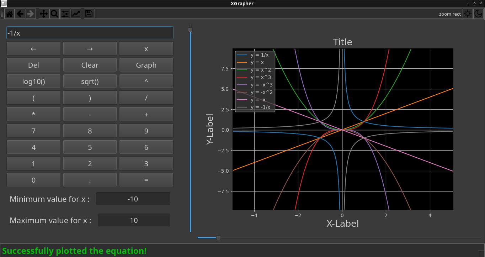

# XGrapher


<!-- <br/> -->
<!--  -->
<!-- <br/> -->


Light Mode                | Dark Mode 
:------------------------:|:---------------------------------:
   |  


<!-- {{{Table of Contents --> 

## Table of Contents

* [Table of Contents](#table-of-contents)
* [Introduction](#introduction)
* [XGrapher DEMO (Plotting)](#xgrapher-demo-plotting)
  * [# y = x](#-y--x)
  * [# y = x/x](#-y--xx)
  * [# y = constant :](#-y--constant-)
  * [# y = x^2](#-y--x2)
  * [# y = sqrt(x) in range range contains -ve and +ve [-100, 100]](#-y--sqrtx-in-range-range-contains--ve-and-ve--100-100)
  * [# y = log10(x) in range range contains -ve and +ve [-100, 100]](#-y--log10x-in-range-range-contains--ve-and-ve--100-100)
  * [# y = 1/x (function with one asymptotic point)](#-y--1x-function-with-one-asymptotic-point)
  * [# y = 1/((x-2)*(x+2)) (function with two asymptotic points)](#-y--1x-2x2-function-with-two-asymptotic-points)
  * [# y = 1/((x-2)*(x-500)*(x-88)) (function with three asymptotic points)](#-y--1x-2x-500x-88-function-with-three-asymptotic-points)
* [XGrapher DEMO (Input Sanitization)](#xgrapher-demo-input-sanitization)
  * [# Empty Equation Input](#-empty-equation-input)
  * [# Garbage Equation Input](#-garbage-equation-input)
  * [# Syntax Error in Equation Input 1](#-syntax-error-in-equation-input-1)
  * [# Syntax Error in Equation Input 2](#-syntax-error-in-equation-input-2)
  * [# Using '**' instead of '^' for exponentiation](#-using--instead-of--for-exponentiation)
  * [# No Range inputted](#-no-range-inputted)
  * [# Garbage Range inputted](#-garbage-range-inputted)
  * [# Reversed Range inputted](#-reversed-range-inputted)
* [XGrapher DEMO (Error Handling)](#xgrapher-demo-error-handling)
  * [# Input range has no intersection with equation's domain](#-input-range-has-no-intersection-with-equations-domain)
  * [# Overflow due to extremely rising/falling equation](#-overflow-due-to-extremely-risingfalling-equation)
  * [# Overflow due to extremely large input Range](#-overflow-due-to-extremely-large-input-range)
* [XGrapher DEMO (Responsive GUI)](#xgrapher-demo-responsive-gui)
  * [# Instant Plotting action &amp; Status Bar responsive animation](#-instant-plotting-action--status-bar-responsive-animation)
  * [# Zoom Sliders for both X and Y Axes](#-zoom-sliders-for-both-x-and-y-axes)
  * [# Toggleable Light and Dark Modes](#-toggleable-light-and-dark-modes)
* [XGrapher DEMO (Customization Settings)](#xgrapher-demo-customization-settings)
  * [# Extensive Graph Customization Settings](#-extensive-graph-customization-settings)
* [Key Features](#key-features)
* [Technical Details](#technical-details)
* [Dependencies &amp; Installation](#dependencies--installation)
  * [Linux](#linux)
  * [Windows](#windows)
  * [MacOS](#macos)
* [Future Features, Improvements, and Fixes to consider](#future-features-improvements-and-fixes-to-consider)


<br/>
<!-- }}} -->

<!-- {{{Introduction --> 
<br/>

## Introduction


<br/>
XGrapher is a cross-platform desktop graphing calculator written in Python. Despite being simple and lightweight, XGrapher provides the ability to graph an indispensable set of mathematical functions such as sqrt() and log10() and it can quickly graph almost every combination of mathematical equation composed of them alongside with other mathematical operators while providing the user with extensive options and customization settings. 
XGrapher uses sophisticated and thoroughly optimized algorithms to compute the properties of the provided equation (such as domain the or asymptotic points if any) and check whether the user input conflicts with them and notifies the user accordingly if any error is encountered.

<br/>
<!-- }}} -->

<!-- {{{XGrapher DEMO (Plotting) --> 
<br/>

## XGrapher DEMO (Plotting)

### # y = x

<br/>

### # y = x/x

<br/>

### # y = constant

<br/>

### # y = x^2

<br/>


### # y = sqrt(x) in range range contains -ve and +ve [-100, 100]

<br/>


### # y = log10(x) in range range contains -ve and +ve [-100, 100]

<br/>


### # y = 1/x (function with one asymptotic point)

<br/>

### # y = 1/((x-2)\*(x+2)) (function with two asymptotic points)

<br/>


### # y = 1/((x-2)\*(x-500)\*(x-88)) (function with three asymptotic points)

<br/>


<!-- }}} -->

<!-- {{{XGrapher DEMO (Input Sanitization) --> 
<br/>

## XGrapher DEMO (Input Sanitization)

### # Empty Equation Input

<br/>


### # Garbage Equation Input

<br/>


### # Syntax Error in Equation Input 1

<br/>

### # Syntax Error in Equation Input 2

<br/>

### # Using '\*\*' instead of '^' for exponentiation

<br/>


### # No Range inputted

<br/>


### # Garbage Range inputted

<br/>

### # Reversed Range inputted

<br/>


<!-- }}} -->

<!-- {{{XGrapher DEMO (Error Handling) --> 
<br/>

## XGrapher DEMO (Error Handling)

### # Input range has no intersection with equation's domain

<br/>


### # Overflow due to extremely rising/falling equation

<br/>

### # Overflow due to extremely large input Range

<br/>


<!-- }}} -->

<!-- {{{XGrapher DEMO (Responsive Zoom Sliders) --> 
<br/>

## XGrapher DEMO (Responsive GUI)

### # Instant Plotting action & Status Bar responsive animation

<br/>

### # Zoom Sliders for both X and Y Axes

<br/>

### # Toggleable Light and Dark Modes

<br/>

<br/>
<!-- }}} -->

<!-- {{{XGrapher DEMO (Customization Settings) --> 
<br/>

## XGrapher DEMO (Customization Settings)

### # Extensive Graph Customization Settings
Curves customization            | Axes customization
:------------------------------:|:--------------------------------:
  |  
<br/>


<br/>
<!-- }}} -->

<!-- {{{XGrapher Code Documentation (Logic Code)--> 
<br/>

## XGrapher Code Documentation (Logic Code)

1. plot_equation(...)
2. process_inputs(...)
3. update_min_max_coordinates(...)
4. compute_domain(...)
5. compute_intersection(...)
6. compute_asymptotic_points(...)
7. insert_asymptotic_points(...)
8. insert_fitting_points(...)


<br/>


### 1. plot_equation(...)
* plot_equation(main_window, equation, x_min_inputted, x_max_inputted)
* This is the main function that plots the given equation.
* It simply calls the process_inputs() function and if it succeeds then it plots the equation and returns True.
* Else it returns False indicating unsucessful plotting.
* This function's implementation code is well explained & documented, please delve into the function and read from within it.

### 2. process_inputs(...)
* process_inputs(main_window, equation, x_min_inputted, x_max_inputted)
* This function is called with each sucessful equation plotting attempt
* This function is by far the largest & most complex function in the program
* Most of the computational processing happens in this function, such as :
    - computing the equation's domain 
    - checking if there is intersection between the inputted range and the equation's domain
    - checking if asymptotic points exists in that intersection
    - inserting these asymptotic points and fitting points around them (if any) to smoothen the curve
* Also, Input Sanitization and Error Handling happens in this function rather being placed in a separate function
* This is preferred since they reside in before, in between, and after the processing phase so it would be hard to place them in a separate function
* This function's implementation code is well explained & documented, please delve into the function and read from within it


### 3. update_min_max_coordinates(...)
* update_min_max_coordinates(main_window, x_points_intersection_range, y_points_intersection_range)
* This function is called with each sucessful equation plotting attempt
* It checks if the horizontal/vertical limits of it exceeds the maximum horizontal/vertical limits of all equations plotted and if so it updates them
* This function is essential to adjust the ranges in which the y & x zoom sliders operate within

### 4. compute_domain(...)
* compute_domain(equation)
* This function is called with each sucessful equation plotting attempt
* This function utilizes the sympy library to compute the domain of the equation 
* This function is essential since we must check whether the equation's domain has an intersection with the range that the user inputted in which we can plot the curve in

### 5. compute_intersection(...)
* compute_intersection(x_points_range_sympy, domain)
* This function is called with each sucessful equation plotting attempt
* This function uses the sympy library to compute the intersecion between the provided x range and the domain of the function
* First it computes the Intersection and converts it to string then it parses it
* Then it splits it and converts it to a List so that it can be processed more easily in the other functions


### 6. compute_asymptotic_points(...)
* compute_asymptotic_points(intersection)
* This function is called with each sucessful equation plotting attempt
* This Function assumes that the parsed intersection is valid and contains at least two elements (else it returns an empty list anyways)
* This Function assumes that asymptotic point is a point whose curve approaches an infinite vertical line at its location "from both sides" (such as in 1/(x-2))
* This Function doesn't consider points whose curve approaches an infinite vertical line at it location  "from a single side" to be an asymptotic point (such as log10(x))
* The algorithm used by the function to find Asymptotic points is as follows (assume intersection holds [-100, 2, 2, 5, 5, 100]): 
    1. Pop the first and last points from the intersection, where these points represent the limits of the intersection (thus intersection will be = [2, 2, 5, 5])
    2. Remove any duplicates present by converting intersection to set then to list again (thus intersection will be [2, 5])
    3. Assign parsed_intersectoin to asymptotic_points
    4. Sort asymptotic_points (because python set isn't sorted by default) then finally return it


### 7. insert_asymptotic_points(...)
* insert_asymptotic_points(asymptotic_points, x_points_intersection_range, y_points_intersection_range)
* This function is called with each sucessful equation plotting attempt.
* This function inserts nan for each asymptotic point of the equation.
* This is required to avoid undesired connections between the minimum and maximum points around the asymptotic point.
* This Function uses an efficient binary search algorithm to search whether the asymptotic points are already inserted and if so it does nothing (since that means they've been inserted earlier with either inf or nan), else it inserts them.
* This function inserts into sorted lists while preserving them being sorted, that's why binary search is used.
* The Complexity of this function is m\*nlog(n) where:
    - m = number of asymptotic points
    - n = number of x-point samples (constant determined by the code (roughly around 1e4))
* Therefore assuming n = 1e4, the function will require roughly 1 second of computational time for each 1e3 asymptotic point.

### 8. insert_fitting_points(...)
* insert_fitting_points(asymptotic_points, x_points_intersection_range, y_points_intersection_range, equation_exec)
* This function is called with each sucessful equation plotting attempt.
* This function inserts a group of fitting points around each asymptotic point.
* This is required to improve the curve smoothnes at these points and avoid sudden rises and falls around them.
* This Function uses an efficient binary search algorithm to search whether the fitting points are already inserted and if so it does nothing (since that means they've been inserted earlier with their corresponding y values), else it inserts them.
* This function inserts into sorted lists while preserving them being sorted, that's why binary search is used.
* The Complexity of this function is m\*nlog(n) where:
    - m = number of fitting points = 5e1 * number of asymptotic points
    - n = number of x-point samples (constant determined by the code (roughly around 1e4))
* Therefore according to this complexity, the function will require roughly 1 second of computational time for each 1e2 asymptotic point.
* This complexity is by far acceptable, but for plotting equations with large number of asymptotic points it is recommended to go with amore efficient algorithmic approach that has a better time complexity than this one
* It is experimentally found that 6e-1 and 5e1 are appropriate and suitable values that :
    1. Achieve the desired curve smoothnes around the asymptotic points
    2. Achieve an applicable execution time for the function according to its complexity
    3. Do not cause the y-zoom slider to overshoot

<br/>
<!-- }}} -->

<!-- {{{XGrapher Code Documentation (GUI Code)--> 
<br/>

## XGrapher Code Documentation (GUI Code)

The GUI Code of the XGrapher application is simple and straight forward..<br/>
It simply consists of a simple class that represents the main Window of the application.<br/>
This class can be instantiated to create instances of the application's main window.<br/>
The following represents the Documentation the main methods of the class:

1. \_\_init\_\_(...)
2. create_tool_bar(...)
3. create_status_bar(...)
4. create_keypad(...)
5. create_range_fields(...)
6. create_axes(...)
7. create_y_range_slider(...)
8. create_x_range_slider(...)
9. y_range_slider_slot(...)
10. x_range_slider_slot(...)
11. status_bar_print(...)
12. update_legend(...)
13. set_graphical_mode(...)

<br/>

### 1. \_\_init\_\_(...)
* \_\_init\_\_(self, SCREEN_WIDTH, SCREEN_HEIGHT)

### 2. create_tool_bar(...)
* create_tool_bar(self)

### 3. create_status_bar(...)
* create_status_bar(self)

### 4. create_keypad(...)
* create_keypad(self)

### 5. create_range_fields(...)
* create_range_fields(self)

### 6. create_axes(...)
* create_axes(self)

### 7. create_y_range_slider(...)
* create_y_range_slider(self)

### 8. create_x_range_slider(...)
* create_x_range_slider(self)

### 9. y_range_slider_slot(...)
* y_range_slider_slot(self)

### 10. x_range_slider_slot(...)
* x_range_slider_slot(self)

### 11. status_bar_print(...)
* status_bar_print(self, message, status)

### 12. update_legend(...)
* update_legend(self)

### 13. set_graphical_mode(...)
* set_graphical_mode(self, graphical_mode)


<br/>
<!-- }}} -->

<!-- {{{Key Features --> 

## Key Features

* Fast, simple, and lightweight.

* Well documented and tested code (40+ unit tests) which improves both user's and developer's experience. 

* Trustworthy Input Sanitization Mechanism.

* Exceptional Error Handling (such as x/0, sqrt(-ve), log(0), ...).

* Efficient handling of Asymptotic Discontinuities in functions.

* Ability to compute the domain and asymptotic points of the specified function.

* Ability to compute the intersection between specified range and equation's domain to plot within it.

* Ability to copy/cut/paste equations using the clipboard.

* Improved user feedback throughout the session.

* Responsive GUI and Status Bar.

* Supports both Light and Dark Mode.

* And much much more!!

<br/>
<!-- }}} -->

<!-- {{{Technical Details --> 

## Technical Details

* Supported OS : Linux/Windows/MacOS

* Language : Python

* GUI Framework : Pyside2

* Graphing Framework : Matplotlib

* Design Approach : Object Oriented Programming

<br/>
<!-- }}} -->

<!-- {{{Dependencies & Installation  --> 

## Dependencies & Installation

### Linux 

Note: the following installation code works in any debian based distribution with the apt package manager, for other distributions please refer to their instructions for package installation.
<br/>
<br/>
Note: some commands might require super user privileges
```
apt install python3
apt install python3-matplotlib
apt install python3-numpy
apt install python3-sympy
apt install python3-pyside2
apt install python3-pyside2.qtcore
apt install python3-pyside2.qtwidgets
apt install python3-pyside2.qtgui
git clone https://github.com/yousef8192/XGrapher.git
cd XGrapher
python3 xgrapher.py
```

### Windows

Please ensure that you have python and the dependencies mentioned in the Linux section successfully installed using pip or any other tools present in Windows then run the file xgrapher.py using the appropriate python command.


### MacOS

Please ensure that you have python and the dependencies mentioned in the Linux section successfully installed using pip or any other tools present in MacOS then run the file xgrapher.py using the appropriate python command.


<br/>
<!-- }}} -->

<!-- {{{Future Features, Improvements, and Fixes to consider --> 
<br/>

## Future Features, Improvements, and Fixes to consider

* Add support for the rest of the mathematical functions (such as trignometric functions and the dirichlet function)

* Add support for other graphing scales (such as the logarithmic scale) to be able to deal with other plot types that require them (such as bode plot)

* Add support for multiple variables and multi-dimensional graphing.

* Add menu bar for more options

* Add the Ability to save Sessions, Graphs, and even individual Curves then load them.

* Add settings page to customize even more options.

* Add the ability to detect system theme and change the application's theme accordingly.

* Improve icon colors in dark mode by inverting the colors so that they are more visible.

* Improve the automatic view fitting for when there are multiple curves in the same graph.

<br/>
<!-- }}} -->


