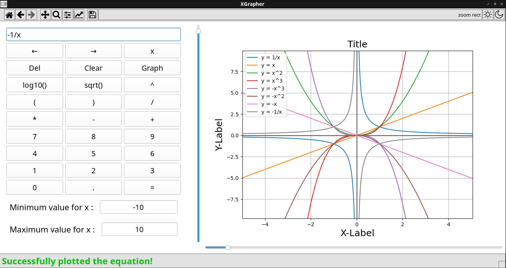

# XGrapher


<!-- <br/> -->
<!--  -->
<!-- <br/> -->


Light Mode                | Dark Mode 
:------------------------:|:---------------------------------:
   |  


<!-- {{{Table of Contents --> 

## Table of Contents

* [Table of Contents](#table-of-contents)
* [Introduction](#introduction)
* [XGrapher DEMO (Plotting)](#xgrapher-demo-plotting)
  * [# y = x](#-y--x)
  * [# y = x/x](#-y--xx)
  * [# y = constant :](#-y--constant-)
  * [# y = x^2](#-y--x2)
  * [# y = sqrt(x) in range range contains -ve and +ve [-100, 100]](#-y--sqrtx-in-range-range-contains--ve-and-ve--100-100)
  * [# y = log10(x) in range range contains -ve and +ve [-100, 100]](#-y--log10x-in-range-range-contains--ve-and-ve--100-100)
  * [# y = 1/x (function with one asymptotic point)](#-y--1x-function-with-one-asymptotic-point)
  * [# y = 1/((x-2)*(x+2)) (function with two asymptotic points)](#-y--1x-2x2-function-with-two-asymptotic-points)
  * [# y = 1/((x-2)*(x-500)*(x-88)) (function with three asymptotic points)](#-y--1x-2x-500x-88-function-with-three-asymptotic-points)
* [XGrapher DEMO (Input Sanitization)](#xgrapher-demo-input-sanitization)
  * [# Empty Equation Input](#-empty-equation-input)
  * [# Garbage Equation Input](#-garbage-equation-input)
  * [# Syntax Error in Equation Input 1](#-syntax-error-in-equation-input-1)
  * [# Syntax Error in Equation Input 2](#-syntax-error-in-equation-input-2)
  * [# Using '**' instead of '^' for exponentiation](#-using--instead-of--for-exponentiation)
  * [# No Range inputted](#-no-range-inputted)
  * [# Garbage Range inputted](#-garbage-range-inputted)
  * [# Reversed Range inputted](#-reversed-range-inputted)
* [XGrapher DEMO (Error Handling)](#xgrapher-demo-error-handling)
  * [# Input range has no intersection with equation's domain](#-input-range-has-no-intersection-with-equations-domain)
  * [# Overflow due to extremely rising/falling equation](#-overflow-due-to-extremely-risingfalling-equation)
  * [# Overflow due to extremely large input Range](#-overflow-due-to-extremely-large-input-range)
* [XGrapher DEMO (Responsive Gui)](#xgrapher-demo-responsive-gui)
  * [# Instant Plotting action &amp; Status Bar responsive animation](#-instant-plotting-action--status-bar-responsive-animation)
  * [# Zoom Sliders for both X and Y Axes](#-zoom-sliders-for-both-x-and-y-axes)
  * [# Toggleable Light and Dark Modes](#-toggleable-light-and-dark-modes)
* [Key Features](#key-features)
* [Technical Details](#technical-details)
* [Dependencies &amp; Installation](#dependencies--installation)
  * [Linux](#linux)
  * [Windows](#windows)
  * [MacOS](#macos)
* [Future Improvements and Fixes to consider](#future-improvements-and-fixes-to-consider)


<br/>
<!-- }}} -->

<!-- {{{Introduction --> 
<br/>

## Introduction


<br/>
XGrapher is a cross-platform desktop graphing calculator written in Python. Despite being simple and lightweight, XGrapher provides the ability to graph an indispensable set of mathematical functions such as sqrt() and log10() and it can quickly graph almost every combination of mathematical equation composed of them alongside with other mathematical operators while providing the user with extensive options and customization settings. 
XGrapher uses sophisticated and thoroughly optimized algorithms to compute the properties of the provided equation (such as domain the or asymptotic points if any) and check whether the user input conflicts with them and notifies the user accordingly if any error is encountered.

<br/>
<!-- }}} -->

<!-- {{{XGrapher DEMO (Plotting) --> 
<br/>

## XGrapher DEMO (Plotting)

### # y = x

<br/>

### # y = x/x

<br/>

### # y = constant :

<br/>

### # y = x^2

<br/>


### # y = sqrt(x) in range range contains -ve and +ve [-100, 100]

<br/>


### # y = log10(x) in range range contains -ve and +ve [-100, 100]

<br/>


### # y = 1/x (function with one asymptotic point)

<br/>

### # y = 1/((x-2)\*(x+2)) (function with two asymptotic points)

<br/>


### # y = 1/((x-2)\*(x-500)\*(x-88)) (function with three asymptotic points)

<br/>


<!-- }}} -->

<!-- {{{XGrapher DEMO (Input Sanitization) --> 
<br/>

## XGrapher DEMO (Input Sanitization)

### # Empty Equation Input

<br/>


### # Garbage Equation Input

<br/>


### # Syntax Error in Equation Input 1

<br/>

### # Syntax Error in Equation Input 2

<br/>

### # Using '\*\*' instead of '^' for exponentiation

<br/>


### # No Range inputted

<br/>


### # Garbage Range inputted

<br/>

### # Reversed Range inputted

<br/>


<!-- }}} -->

<!-- {{{XGrapher DEMO (Error Handling) --> 
<br/>

## XGrapher DEMO (Error Handling)

### # Input range has no intersection with equation's domain

<br/>


### # Overflow due to extremely rising/falling equation

<br/>

### # Overflow due to extremely large input Range

<br/>


<!-- }}} -->

<!-- {{{XGrapher DEMO (Responsive Zoom Sliders) --> 
<br/>

## XGrapher DEMO (Responsive Gui)

### # Instant Plotting action & Status Bar responsive animation

<br/>

### # Zoom Sliders for both X and Y Axes

<br/>

### # Toggleable Light and Dark Modes

<br/>

<br/>
<!-- }}} -->

<!-- {{{XGrapher DEMO (Customization Settings) --> 
<br/>

## XGrapher DEMO (Customization Settings)

### # Extensive Graph Customization Settings :
Curves customization            | Axes customization
:------------------------------:|:--------------------------------:
  |  
<br/>


<br/>
<!-- }}} -->

<!-- {{{Key Features --> 

## Key Features

* Fast, simple, and lightweight.

* Well documented and tested code (40+ individual tests) which improves both user's and developer's experience. 

* Trustworthy Input Sanitization Mechanism.

* Exceptional Error Handling (such as x/0, sqrt(-ve), log(0), ...).

* Efficient handling of Asymptotic Discontinuities in functions.

* Ability to compute the domain and asymptotic points of the specified function.

* Ability to find the intersection between the specified range and the domain of the function to plot the curve within it.

* Ability to copy/cut/paste equations using the clipboard.

* Improved user feedback throughout the session.

* Responsive Gui and Status Bar.

* Supports both Light and Dark Mode.

* And much much more!!

<br/>
<!-- }}} -->

<!-- {{{Technical Details --> 

## Technical Details

* Supported OS : Linux/Windows/MacOS

* Language : Python

* GUI Framework : Pyside2

* Graphing Framework : Matplotlib

* Design Approach : Object Oriented Programming

<br/>
<!-- }}} -->

<!-- {{{Dependencies & Installation  --> 

## Dependencies & Installation

### Linux 

Note, the following installation code works in any debian based distribution with the apt package manager, for other distributions please refer to their instructions for package installation.

```
sudo apt install python3
sudo apt install python3-matplotlib
sudo apt install python3-numpy
sudo apt install python3-sympy
sudo apt install python3-pyside2
sudo apt install python3-pyside2.qtcore
sudo apt install python3-pyside2.qtwidgets
sudo apt install python3-pyside2.qtgui
git clone https://github.com/yousef8192/XGrapher.git
cd XGrapher
python3 xgrapher.py
```

### Windows

Please ensure that you have python and the dependencies mentioned in the Linux section successfully installed using pip or any other tools present in Windows then run the file xgrapher.py using the appropriate python command.


### MacOS

Please ensure that you have python and the dependencies mentioned in the Linux section successfully installed using pip or any other tools present in MacOS then run the file xgrapher.py using the appropriate python command.


<br/>
<!-- }}} -->

<!-- {{{Future Improvements and Fixes to consider --> 
<br/>

## Future Improvements and Fixes to consider

* Add support for the rest of the mathematical functions (such as trignometric functions) and the dirichlet function)

* Add support for other graphing scales (such as the logarithmic scale) to be able to deal with other plot types that require them (such as bode plot)

* Add support for multiple variables and multi-dimensional graphing.

* Add menu bar for more options

* Add the Ability to save Sessions, Graphs, and even individual Curves then load them.

* Add settings page to customize even more options.

* Add the ability to detect system theme and change the application's theme accordingly.

* Improve icon colors in dark mode by inverting the colors so that they are more visible.

* Improve the automatic view fitting for when there are multiple curves in the same graph.


<br/>
<!-- }}} -->


